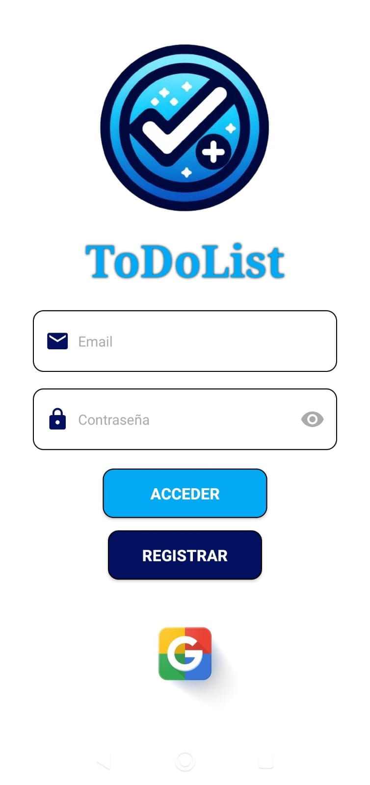
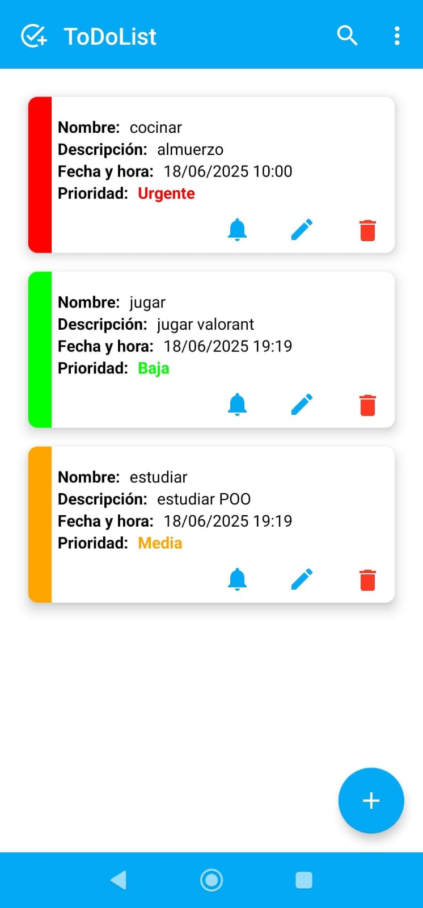
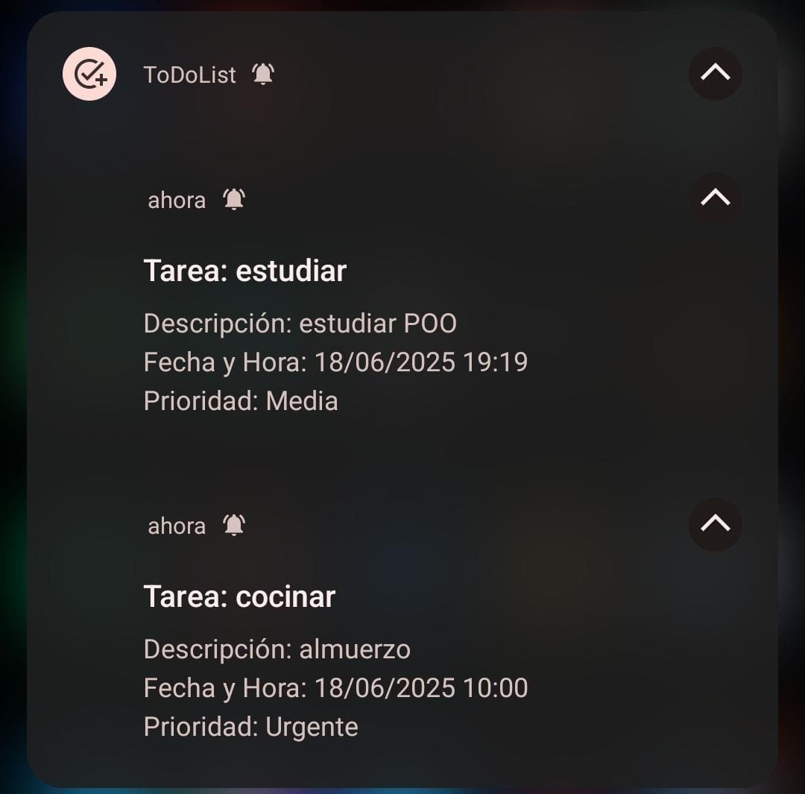

# 📝 ToDoList – App Android con Firebase

> Aplicación móvil para la gestión de tareas personales, desarrollada en Android Studio usando Kotlin y Firebase.  
> Incluye autenticación, CRUD en Firestore, notificaciones programadas y monitoreo con Crashlytics y Analytics.

---

## 🚀 Funcionalidades

✔️ Registro e inicio de sesión con **correo y Google**  
✔️ Gestión de tareas: **crear, leer, actualizar y eliminar (CRUD)**  
✔️ **Filtros personalizados** para visualizar tareas por estado  
✔️ **Notificaciones programadas** con `AlarmManager` y Firebase Cloud Messaging  
✔️ **Sincronización en tiempo real** con Cloud Firestore  
✔️ Integración con **Firebase Crashlytics** para monitoreo de errores  
✔️ Análisis de uso mediante **Google Analytics for Firebase**

---

## 🛠️ Tecnologías Utilizadas

- 🧑‍💻 Kotlin + Android XML
- 🔐 Firebase Authentication
- 🔥 Cloud Firestore
- 📲 Firebase Cloud Messaging (FCM)
- ⏰ AlarmManager
- 🧩 Crashlytics
- 📊 Analytics for Firebase

---

## ⚙️ Instalación y Ejecución

1. Clona este repositorio:
   ```bash
   git clone https://github.com/neotest-dev/ToDoList.git
2. Abre el proyecto en **Android Studio**
3. Verifica que tengas el archivo `google-services.json` en la carpeta `/app`
4. Ejecuta el proyecto en un emulador o dispositivo real

---

## 📸 Capturas de Pantalla

> _Agrega aquí tus imágenes o gifs mostrando tu app en acción. Por ejemplo:_

| Login                            | Lista de tareas                   | Notificación                             |
|----------------------------------|-----------------------------------|------------------------------------------|
|  |  |  |

---

## 👥 Colaboradores

- [@neotest-dev](https://github.com/neotest-dev)
- [@julio20950](https://github.com/julio20950)

---

## 🗂️ Releases

Este proyecto se organizó por sprints y versiones.

📄 Puedes revisar el historial completo en la pestaña de [Releases](https://github.com/neotest-dev/ToDoList/releases)

---

## 📄 Licencia

Este proyecto fue desarrollado con fines académicos como parte de un curso universitario.  
Queda libre para uso educativo, personal y de aprendizaje.

---
